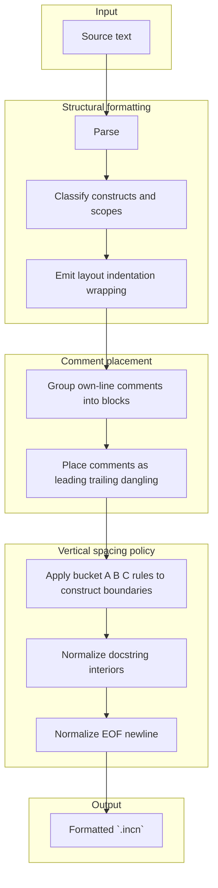

# RFC 053: Formatter vertical spacing (three blank-line buckets)

- **Status:** Draft
- **Created:** 2026-04-08
- **Author(s):** Danny Meijer (@dannymeijer)
- **Related:** RFC 027 (incan vocab crate)
- **Issue:** https://github.com/dannys-code-corner/incan/issues/336
- **RFC PR:** —
- **Written against:** v0.2
- **Shipped in:** —

## Summary

This RFC defines **normative vertical spacing rules** for Incan’s **source formatter** (`incan fmt` and equivalent editor actions). Spacing is described with **three blank-line buckets**: (1) **exactly two** empty lines, (2) **exactly one** empty line, and (3) **at most one** empty line (zero or one) — plus **end-of-file** and **docstring-interior** caps. Stand-alone comments are handled through explicit placement rules; they do **not** themselves satisfy blank-line quotas. The goal is a **stable, citeable contract** (Python's PEP 8–like in spirit) so formatted output is predictable, diffs stay readable, and companion repos can align CI and review expectations without reverse-engineering formatter internals.

## Core model

1. **Blank line** — A **source line** that contains **no** characters other than **horizontal whitespace** (spaces and tabs).
2. **Three buckets** — Every **transition** between formatted constructs falls into one of three mutually exclusive spacing regimes: **exactly two**, **exactly one**, or **zero or one** consecutive blank lines (never two or more).
3. **String and comment safety** — Rules in this RFC govern **layout between Incan constructs**, not arbitrary text. **String literals** and **character literals** (including multi-line forms) **must not** be rewritten by vertical-spacing logic in a way that changes their **decoded** content; implementations **must** treat literal bodies as opaque for blank-line normalization. Stand-alone comments are placed relative to nearby constructs by the comment-placement rules in this RFC and do **not** count as blank lines.
4. **Docstring interior** — The **interior** of a module, class, model, or function **docstring** (the textual payload between opening and closing `"""` delimiters) uses the **at most one** rule for consecutive empty lines **within that payload**.
5. **End of file** — Every formatted `.incn` file **must** end with **exactly one** line terminator after the last logical line of source (conventional single trailing newline).

## Motivation

Vertical gaps currently arise from several independent mechanisms such as
top-level declaration spacing, per-statement leading blank lines, match and
block layout, docstring emission, comment reattachment, and EOF handling. That
fragmentation makes it easy for extra consecutive blank lines to appear, for
example after large `match` arms, and for EOF newline behavior to disagree with
user expectations. Authors and reviewers need one document that states what the
formatter guarantees, similar to how Python ecosystems cite PEP 8 for style,
without reading formatter internals.

## Goals

- Define **normative** vertical spacing using the **three buckets** plus **EOF** and **docstring-interior** rules.
- Classify **top-level** and **in-type** declarations so implementers know which bucket applies at each boundary.
- Give **guide-level** guidance for humans (“when do I expect a big gap vs a tight gap?”).
- Stay independent of **non-spacing** formatter choices (line length, quote style, import wrapping) except where they affect whether a declaration is **single-line** vs **body-bearing**.

## Non-Goals

- Changing **language syntax** or **semantics**; this RFC is **tooling output** only.
- Specifying **full** pretty-printing for every construct (parentheses, wrapping, commas); only **vertical blank-line policy** is in scope.
- Preserving **every** author-chosen blank line everywhere; the formatter **may** normalize spacing to this RFC.
- Defining **non-formatter** editors’ behavior when not using the reference formatter.

## Guide-level explanation

Think of module layout like a familiar Python style guide: **big** declarations at module scope “breathe” with **two** empty lines between them when they carry a real body; **methods** inside a type are separated by **one** empty line; **imports**, **constants**, and **one-line type aliases** stay **tight**—either **no** empty line or **one**, but never a **double** gap. **Docstrings** follow the same **tight** rule **inside** the quoted text: you may separate paragraphs with **one** blank line, but the formatter **must not** leave **multiple** consecutive empty lines inside the docstring payload.

Files always end with **one** trailing newline so POSIX tools and diffs behave consistently.

For example, imports and one-line aliases stay in the tight bucket, while body-bearing top-level declarations get the larger separation:

```incan
from std.http import Client
from std.json import JsonValue

type UserId = str

model User:
    id: UserId
    profile: JsonValue


def load_user(client: Client, id: UserId) -> User:
    ...


class UserService:
    def fetch(self, client: Client, id: UserId) -> User:
        ...

    def store(self, user: User) -> None:
        ...
```

Inside docstrings, paragraph breaks remain possible, but repeated empty runs collapse back to a single blank line:

```incan
def explain() -> str:
    """
    First paragraph.

    Second paragraph.
    """
    ...
```

## Reference-level explanation (precise rules)

### Buckets (normative)

- **Bucket A — Exactly two blank lines:**  
    Between the **last non-blank line** of a **preceding** top-level declaration and the **first non-blank line** of a **following** top-level declaration, there **must** be **exactly two** consecutive blank lines, **if and only if** **both** declarations are **top-level body-bearing declarations** as defined below. No other transition **may** use bucket A.
- **Bucket B — Exactly one blank line:**  
    Between the **last non-blank line** of a **preceding** member and the **first non-blank line** of a **following** body-bearing member inside the **same** `class`, `model`, `trait`, `type`, or `enum` body (including **methods** and other **indented** member declarations), there **must** be **exactly one** consecutive blank line, unless this RFC explicitly places that boundary in bucket C. This includes mixed bodies where one or more **single-line** members are followed by a **body-bearing** member: the blank line before the body-bearing member still uses bucket B, while adjacent single-line members that are not followed by a body-bearing member remain in bucket C.
- **Bucket C — At most one blank line (zero or one):**  
    For every transition **not** covered by bucket A or B, the formatter **must** emit **zero** or **one** consecutive blank line between the **last non-blank line** of the preceding construct and the **first non-blank line** of the following construct. It **must not** emit **two** or more consecutive blank lines. This bucket applies to **module docstring** boundaries, **import** runs, **const** and **static** declarations, **single-line** `type` and `newtype` declarations, transitions from **imports** to **non-imports**, and **all** statement-level spacing inside function bodies and other indented blocks unless a future RFC narrows a subset. This RFC does **not** impose any further normalization within bucket C: when both **zero** and **one** blank line satisfy the bucket, either form is acceptable.

### Top-level body-bearing declarations (bucket A eligibility)

The following forms, when declared at **module top level**, count as **body-bearing** for bucket A **when** they are **not** in the **single-line** shape described in “Single-line type forms”:

- `def` (function) with an indented suite.
- `class` with an indented suite.
- `model` with an indented suite.
- `enum` with an indented suite.
- `trait` with an indented suite.
- `type` (type alias) or `newtype`/`rusttype` whose formatted shape includes an **indented body** or **multi-line** right-hand side as determined by the formatter’s wrapping rules (i.e. not a single-line form).

**Module** and **file** leading **docstrings** are **not** body-bearing declarations for bucket A; spacing after a module docstring follows bucket C (typically **one** blank line before the next top-level item).

### Single-line type forms (bucket C)

A **top-level** `type` alias (or `newtype` / `rusttype`) that the formatter emits as a **single non-empty source line** (no indented suite) **must** be treated as **non-body-bearing** for bucket A. Consecutive such declarations **must** use bucket C between them (**zero** or **one** blank line, never two or more).

### Vocab-registered surfaces

Declaration- and block-shaped surfaces introduced through RFC 027 **must** inherit the same vertical-spacing bucket rules as their corresponding formatter surface kinds rather than defining library-specific spacing regimes. A vocab-registered declaration that formats with the same structural shape as `def`, `class`, `model`, `trait`, `enum`, or another body-bearing declaration **must** use the same bucket behavior that this RFC assigns to that shape.

This means, for example, that a library keyword registered as a function-shaped declaration **must** inherit the same top-level and in-type spacing behavior as `def`, and a block declaration **must** inherit the spacing behavior of the corresponding core block structure unless a later RFC explicitly defines a narrower rule. Formatter metadata **must not** override these vertical-spacing buckets as part of this RFC; any future formatter configurability belongs in a separate formatter/configuration RFC.

For example, if a library surface registers `step` as a function-shaped declaration, two top-level `step` declarations with bodies **must** be separated by bucket A exactly as two top-level `def` declarations would be:

```incan
step normalize(input: JsonValue) -> JsonValue:
    ...


step persist(input: JsonValue) -> None:
    ...
```

### Docstring interiors

Inside the delimited **docstring payload** (between the opening `"""` and closing `"""`), the formatter **must not** output **two** or more consecutive **empty** payload lines. Any run of **empty** lines in the payload **must** collapse to **at most one** empty line. Non-empty payload lines **must** preserve their relative **non-blank** content subject to existing trimming and indentation rules outside this RFC.

### End of file

The formatted output **must** contain **exactly one** `U+000A` (LF) as the final character, **except** that an **empty** file **may** be represented as empty or as a single LF; the reference formatter **should** prefer a single LF for an empty module for consistency.

### Determinism

For a fixed source input and formatter version, applying this RFC’s spacing rules **must** yield the **same** vertical spacing in the formatted output.

## Design details

- **Own-line versus end-of-line comments:** A stand-alone comment line and a trailing inline comment are different layout cases. A trailing inline comment stays on its construct line; only stand-alone comment lines participate in the placement rules below.
- **Comment blocks:** Consecutive own-line comments at the same indentation level with no blank line between them form a single **comment block**.
- **Same-scope placement:** Own-line comment blocks attach only to constructs at the **same indentation level**. A top-level comment block does not attach into an indented class or function body, and an indented comment block does not attach back out to a top-level construct.
- **Leading / trailing / dangling placement:** Comment blocks are placed relative to nearby constructs as **leading**, **trailing**, or **dangling** comments rather than being counted as blank lines. The formatter should preserve comment intent by keeping comments close to the construct they document.
- **Bucket measurement after placement:** After comment placement is determined, bucket classification and blank-line counting are evaluated between the resulting **construct bundles** (for example `comment block + def`, or `import + trailing comment block`) rather than through the comment lines themselves.
- **Forward attachment rule:** If a same-scope comment block is immediately followed by a same-scope construct with **no blank line** between the end of the block and the first line of that construct, the block becomes a **leading** comment block of the following construct.
- **Trailing attachment rule:** If a same-scope comment block is followed by a same-scope construct but there is **one or more** blank lines between the end of the block and the following construct, the block becomes a **trailing** comment block of the preceding same-scope construct instead.
- **End-of-scope comments:** A same-scope comment block with no following same-scope construct becomes a **trailing** comment block of the preceding same-scope construct if one exists; otherwise it is treated as leading commentary for the enclosing scope.
- **Inline comments:** A trailing inline comment on a non-blank source line does **not** create its own spacing boundary; the surrounding transition is still classified by the construct-bearing line it appears on.
- **Relation to RFC 027:** RFC 027 already defines formatter dispatch by structural surface kind rather than keyword text; this RFC fixes the vertical-spacing consequences of that rule so library-owned declaration surfaces do not invent their own blank-line behavior ad hoc.
- **Compatibility:** Projects **should** expect **one-time** spacing diffs when upgrading to a formatter that fully enforces this RFC; CI **may** gate on `incan fmt --check` (or equivalent).
- Mixed bodies follow the structural rule above: adjacent single-line members remain in bucket C, and the blank line before a following body-bearing member such as `def is_operator(...)` uses bucket B.

### Worked example (non-normative)

The following composite example is intended to pressure-test the rules across module docstrings, imports, comments, single-line declarations, body-bearing declarations, mixed enum members, function-body spacing, and docstring interiors:

```incan
"""Module summary.

Second paragraph.
"""

from std.http import Client
from std.json import JsonValue

# Module-scoped values stay in bucket C.
const DEFAULT_TIMEOUT = 30
static USER_AGENT = "prism"

type UserId = str

model User:
    """User record.

    Second paragraph.
    """
    id: UserId
    profile: JsonValue


enum Token:
    Plus
    Minus

    # Mixed bodies still use bucket B before the method.
    def is_operator(self) -> bool:
        match self:
            Token.Plus => True
            Token.Minus => True

            _ => False  # Inline comment; no separate spacing boundary.


def fetch_user(client: Client, id: UserId) -> User:
    """First paragraph.

    Second paragraph.
    """

    # Statement-level spacing is bucket C.
    request = client.build_request(id)

    if request.needs_retry():
        log("retrying")

    match request.execute():
        Ok(response) => parse_user(response.body)
        Err(err) => raise err
```

- The **module docstring** interior contains **one** blank line between paragraphs, which is permitted by the docstring-interior cap; the gap after the closing docstring and before the first import is bucket C.
- The two **import** lines remain in bucket C and therefore do not require a blank line between them.
- The stand-alone module comment is placed relative to nearby code rather than counted as a blank line. Its presence therefore does not itself satisfy or violate a bucket quota.
- `const DEFAULT_TIMEOUT`, `static USER_AGENT`, and the single-line alias `type UserId = str` all remain in bucket C. This RFC intentionally leaves **zero** versus **one** blank line within that bucket to formatter choice or preserved author preference where the implementation allows it.
- The transition from the single-line alias `type UserId = str` to `model User:` is still bucket C because the alias is **not** body-bearing for bucket-A purposes.
- The transition from `model User:` to `enum Token:` is bucket A because both are top-level body-bearing declarations; the example therefore uses **exactly two** blank lines there.
- Inside `enum Token`, the variants `Plus` and `Minus` remain in bucket C relative to each other, but the blank line before `def is_operator(...)` is bucket B because the method is a following **body-bearing** member.
- The blank line inside the `match` body before `_ => False` is bucket C because statement-level spacing inside indented blocks is bucket C unless another RFC narrows it.
- The inline comment on `_ => False` does not create a second spacing boundary; it is part of the same non-blank source line.
- The transition from `enum Token:` to `def fetch_user(...)` is bucket A because both are top-level body-bearing declarations.
- The function docstring interior again demonstrates the **at most one** empty-line rule for docstring payloads.
- The statement-level blank lines inside `fetch_user(...)` are bucket C, so one blank line is acceptable but two or more are not.

For same-scope comments before a following construct, placement depends on whether there is a blank line between the comment block and that following construct:

```incan
type UserId = str

# comment about the function
def a_function() -> None:
    ...
```

- The transition from `type UserId = str` to `def a_function(...)` is still bucket C because the single-line alias is not body-bearing.
- Because there is **no** blank line between the comment and `def a_function(...)`, the comment is treated as a **leading** comment of the function.
- The bucket-C blank line is therefore measured between `type UserId = str` and the `comment + def a_function(...)` bundle.

By contrast, in the following spelling the comment becomes a **trailing** comment of the alias because a blank line separates it from the following construct:

```incan
type UserId = str
# comment about the alias

def a_function() -> None:
    ...
```

- The blank line between the comment and `def a_function(...)` prevents the comment from attaching forward.
- The comment therefore stays with `type UserId = str`, and the formatter then applies the ordinary bucket-C boundary to the following function.

### Canonical comment-placement examples (normative, regression-oriented)

The following examples are normative comment-placement outcomes under this RFC and are intended to be stable enough to serve as formatter regression tests.

```incan
from std.http import Client
# json helpers
from std.json import JsonValue
```

- The comment block attaches **forward** to `from std.json import JsonValue` because there is no blank line between the comment and the following same-scope import.

```incan
from std.http import Client
# http helpers

from std.json import JsonValue
```

- The comment block attaches **backward** to `from std.http import Client` because a blank line separates it from the following same-scope import.

```incan
class Service:
    config: Config

    # public API
    def fetch(self) -> Result:
        ...
```

- The indented comment block attaches **forward** to `def fetch(...)` because it is at the same indentation level as the method and there is no blank line between them.

```incan
class Service:
    config: Config
    # configuration metadata

    def fetch(self) -> Result:
        ...
```

- The indented comment block attaches **backward** to `config: Config` because a blank line separates it from the following same-scope method.

```incan
type UserId = str

# first line
# second line
def load_user(id: UserId) -> User:
    ...
```

- The two adjacent comment lines form one **comment block** and attach **forward** to `def load_user(...)`.

```incan
def load_user(id: UserId) -> User:
    ...

# TODO: split retries
```

- The final comment block becomes a **trailing** comment block of `def load_user(...)` because there is no following same-scope construct in the module.

```incan
class Service:
    def outer(self) -> None:
        prepare()

        # same-scope note
        commit()


# top-level note
def build_service() -> Service:
    ...
```

- `# same-scope note` attaches within the function body because it shares that indentation level with `commit()`.
- `# top-level note` does **not** attach into the class body because it is at a different indentation level; it attaches **forward** to `def build_service(...)`.
- Because `class Service` and `def build_service(...)` are both top-level body-bearing declarations, bucket A is measured between `class Service` and the `comment + def build_service(...)` bundle, so the example uses **exactly two** blank lines there.

## Alternatives considered

- **Implementation-only fixes without an RFC:** Rejected for this work because spacing is **user-visible** and **cross-repo**; a written contract reduces debate and drift.
- **PEP 8 verbatim:** Rejected; Incan has imports, models, interop surfaces,
  and docstrings that do not map 1:1 to Python, so the bucket rules should be
  Incan-specific while keeping the same spirit for top-level breathing room and
  tight imports.

## Drawbacks

- Stricter normalization **will** produce churn in large generated or hand-edited files until repositories reformat.
- Some authors who preferred **two** blank lines inside function bodies **must** accept bucket C there unless a future RFC relaxes a subset.

## Implementation architecture (non-normative)

This section illustrates a **foreseen simplification** of the formatting pipeline for **vertical space** only. It is **not** normative; conforming implementations **may** use any internal structure that satisfies the reference-level rules. The point of the diagram is to show where **construct classification**, **comment placement**, **blank-line policy**, **docstring-interior normalization**, and **EOF normalization** interact.



**Intent:** many call sites currently contribute newline decisions
independently. The foreseen shape concentrates policy in one vertical-spacing
stage that runs on line-structured output after same-scope construct
classification and comment placement while respecting string and char literal
boundaries. That keeps bucket rules, docstring-interior normalization, and EOF
normalization conceptually centralized while emitters focus on syntax-shaped
text.

## Layers affected

- **Formatter:** the reference formatter **must** enforce the bucket rules, docstring-interior cap, and EOF rule described in this RFC.
- **LSP / Tooling:** format-on-save and format-range **should** apply the same spacing contract so editor actions do not diverge from `incan fmt`.
- **Parser / AST:** implementations **may** require richer classification signals (for example single-line vs body-bearing declarations) if those are not already explicit in the formatting input.
- **Documentation:** contributor-facing formatter docs **should** link to this RFC as the vertical-spacing contract.

## Design Decisions

- The formatter contract is intentionally expressed through three blank-line buckets rather than ad hoc formatter heuristics.
- Stand-alone comments do not satisfy blank-line quotas by themselves; placement rules govern how they interact with spacing.
- The RFC is intended as the normative vertical-spacing contract for both `incan fmt` and editor-integrated formatting surfaces.
