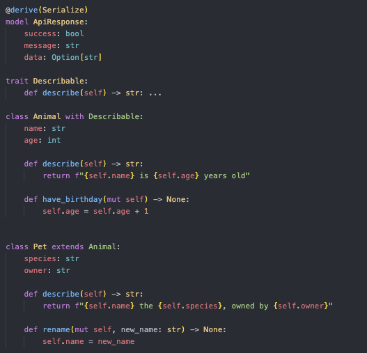

# Editor & IDE Setup

> Note: Incan-specific tooling is in development. This guide will be updated as the tooling improves.

On this page:

- [Syntax Highlighting](#syntax-highlighting)
- [Language Server (LSP)](#language-server-lsp)
- [Format on Save](#format-on-save)
- [Recommended Extensions](#recommended-extensions)

## Syntax Highlighting

<!-- markdownlint-disable MD033 -->
>   
> *<small>Example of Incan Syntax Highlighting in VS Code</small>*
<!-- markdownlint-enable MD033 -->

### VS Code / Cursor (Recommended)

The Incan extension provides full syntax highlighting for `.incn` files.

**Installation (recommended):**

1. Download the `.vsix` from the latest Incan GitHub release.
2. In VS Code/Cursor: Extensions → “Install from VSIX…”
3. Restart VS Code/Cursor
4. Open any `.incn` file - syntax highlighting should work automatically

**Installation (dev/fallback):**

If you’re working from a clone of this repo, you can copy the extension folder directly:

```bash
# macOS/Linux
cp -r editors/vscode ~/.vscode/extensions/incan-language

# Or for Cursor
cp -r editors/vscode ~/.cursor/extensions/incan-language
```

**Features:**

- Full syntax highlighting for all Incan constructs
- Keywords: `model`, `class`, `trait`, `enum`, `newtype`, `async`, `await`
- Rust-style operators: `?`, `::`
- F-string interpolation highlighting
- Type annotations
- Decorators (`@derive`, `@skip`, etc.)
- Markdown code block highlighting for `incan` language
- **LSP integration** - Diagnostics, hover, go-to-definition (requires incan-lsp)

See [`editors/vscode/README.md`](https://github.com/dannys-code-corner/incan/blob/main/editors/vscode/README.md) for full
details.

**Alternative**: Use Python highlighting

If you don't want to install the extension:

1. Open Settings (`Cmd/Ctrl` + `,`)
2. Search for "files.associations"
3. Add: `"*.incn": "python"`

> Note: Although most of the syntax for Incan is supported by Python, using Python highlighting will not provide the
> full Incan experience.
> It's a good way to 'get started' quickly without installing the extension.

### Vim/Neovim

Add to your config:

```vim
" Associate .incn files with Python syntax
autocmd BufNewFile,BufRead *.incn set filetype=python
```

### JetBrains IDEs (PyCharm, IntelliJ)

1. Go to Settings → Editor → File Types
2. Find "Python" and add `*.incn` to registered patterns

## Language Server (LSP)

The Incan Language Server provides IDE integration:

- **Real-time diagnostics** - See errors as you type
- **Hover information** - View types and signatures
- **Go-to-definition** - Jump to symbol definitions
- **Completions** - Keywords and symbols

See [Language Server](lsp.md) for setup instructions. If you develop the compiler from a clone, prefer `make build` so
`incan` and `incan-lsp` on your `PATH` both point at `target/debug` (see the LSP guide).

## Format on Save

### VS Code / Cursor

Once the Incan extension is available, format-on-save will be supported.

For now, you can set up a task or use a file watcher:

```json
// .vscode/tasks.json
{
  "version": "2.0.0",
  "tasks": [
    {
      "label": "Format Incan",
      "type": "shell",
      "command": "incan fmt ${file}",
      "group": "build",
      "presentation": {
        "reveal": "silent"
      }
    }
  ]
}
```

## Recommended Extensions

- **Error Lens** - Inline error display
- **TODO Highlight** - Track TODOs in code

## Next Steps

- [Formatting Guide](formatting.md) - Code style and `incan fmt`
- [Language Guide](../../language/index.md) - Learn Incan syntax and features
- [Examples](https://github.com/dannys-code-corner/incan/tree/main/examples) - Sample programs
